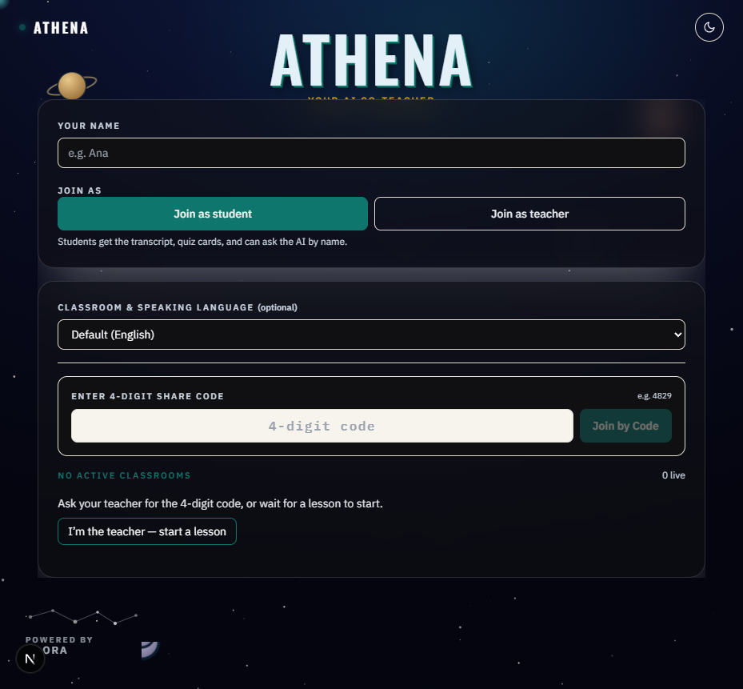
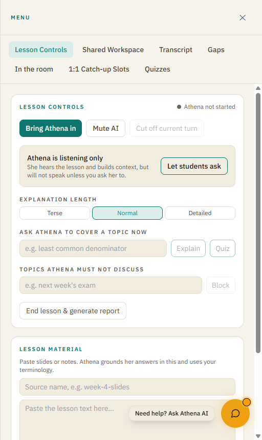
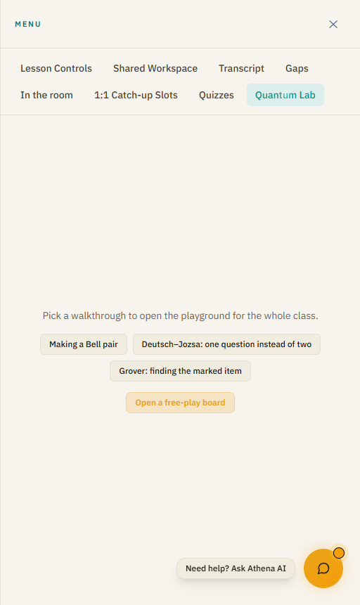
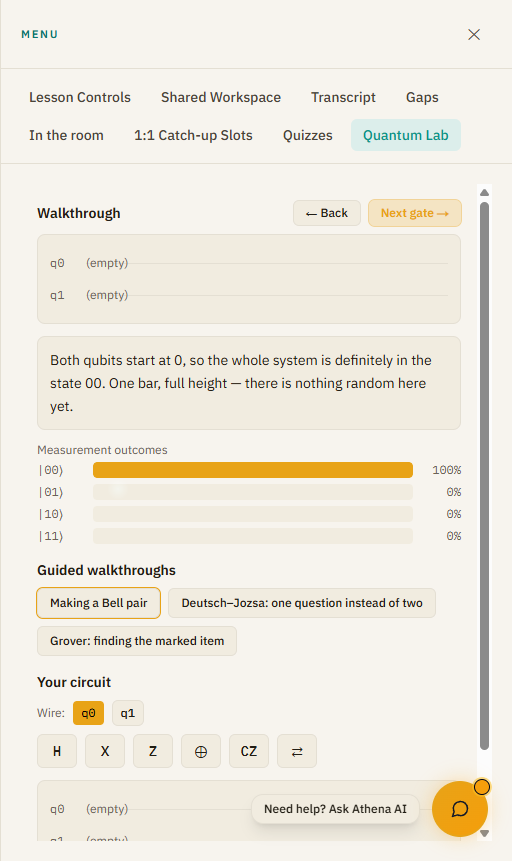
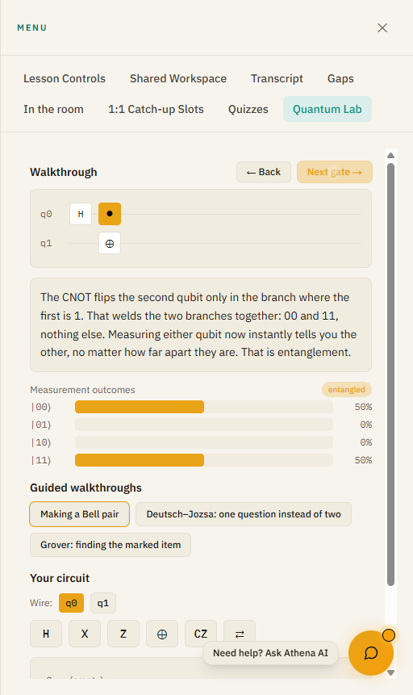
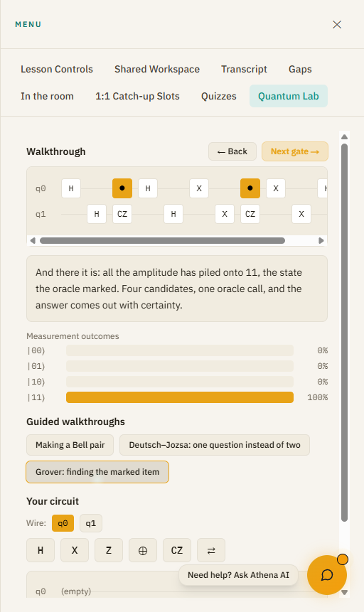
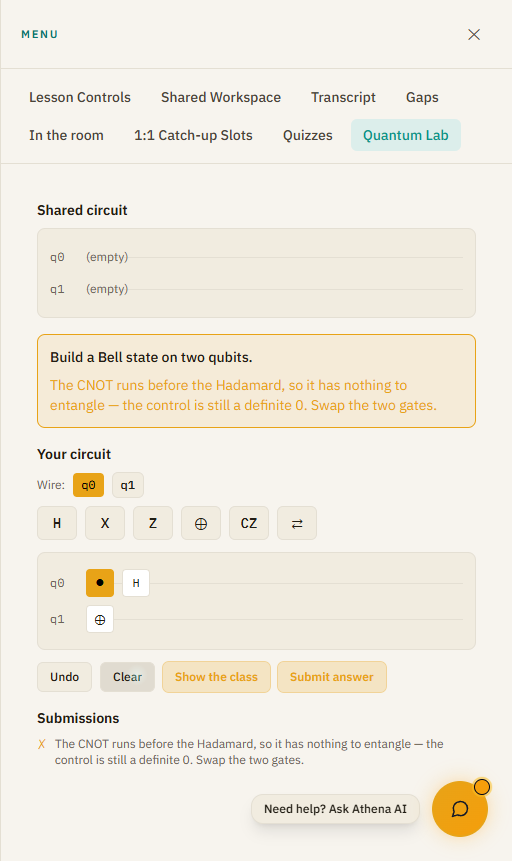
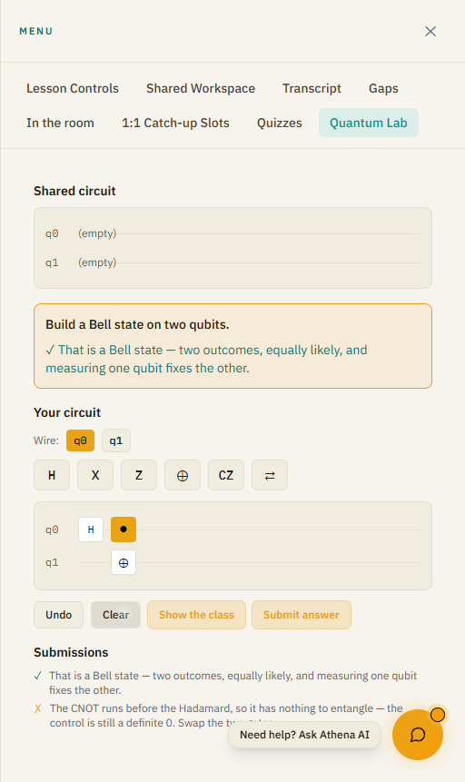
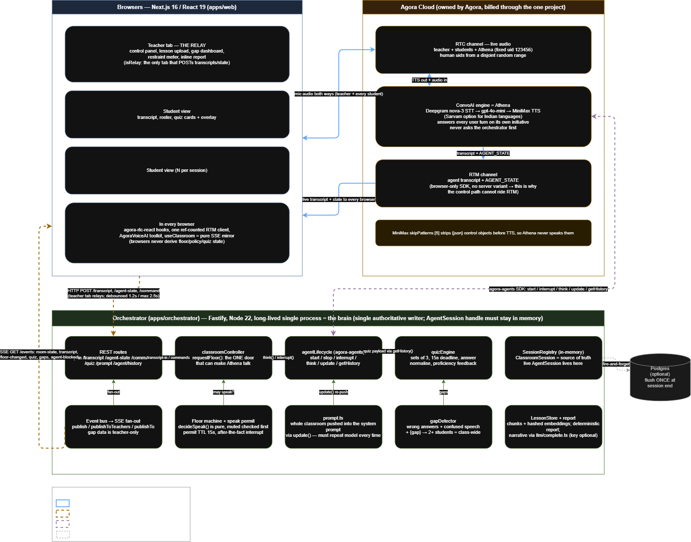
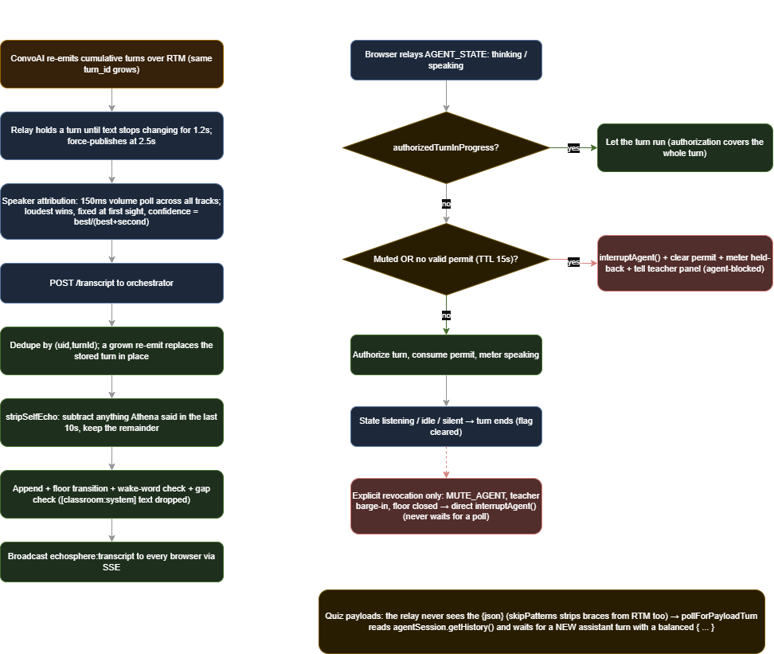

# Athena EchoSphere

**An AI co-teacher that joins a live classroom by voice — and can now teach quantum computing with a circuit simulator she drives herself.**

> **SIH 2026 · PS 26140** — *AI-Based Interactive Quantum Algorithm Learning Platform* (Egreen Quanta, Smart Education)

Quantum computing is hard to teach for one specific reason: nothing is visible. A student can read that a Hadamard gate "creates superposition" and that a CNOT "entangles two qubits," and still have no idea what either sentence means, because there is nothing to look at and nothing to get wrong. Worse, the single most common misconception — that gate order is a detail — is invisible on paper. `H` then `CNOT` entangles two qubits. `CNOT` then `H` does not. The circuits look nearly identical.

Athena EchoSphere makes that difference visible, audible, and gradeable. A teacher opens a live classroom. Students join by a 4-digit code. An AI co-teacher joins the same voice channel, explains a circuit out loud, **puts that circuit on everyone's screen as she describes it**, watches what students build in response, and tells them exactly what went wrong — not "incorrect," but *"the CNOT runs before the Hadamard, so it has nothing to entangle."*

---

## Table of Contents

- [The problem](#the-problem)
- [What it does](#what-it-does)
- [See it running](#see-it-running)
  - [1. The classroom](#1-the-classroom)
  - [2. The Quantum Lab](#2-the-quantum-lab)
  - [3. Guided walkthroughs](#3-guided-walkthroughs)
  - [4. Grading by physics, not by answer key](#4-grading-by-physics-not-by-answer-key)
- [The two-way loop](#the-two-way-loop-the-core-of-ps-26140)
- [How the simulator works](#how-the-simulator-works)
- [Why the narration is a constant](#why-the-narration-is-a-constant)
- [Architecture](#architecture)
- [The classroom platform underneath](#the-classroom-platform-underneath)
- [Tech stack](#tech-stack)
- [Testing](#testing)
- [Getting started](#getting-started)
- [Environment variables](#environment-variables)
- [Project structure](#project-structure)
- [Known limitations](#known-limitations)

---

## The problem

PS 26140 asks for an interactive platform that teaches quantum algorithms. Breaking that into what a student actually needs:

| Need | Why the usual approach fails |
|---|---|
| **See a circuit's effect** | Textbook state vectors are 8 complex numbers. A bar chart is a probability. |
| **Discover that order matters** | Being *told* "order matters" teaches nothing. Dragging two gates and watching entanglement vanish does. |
| **Step through a real algorithm** | Grover's diffusion operator is 9 gates. Shown all at once, it's noise. |
| **Get feedback that names the mistake** | "Incorrect" tells a student nothing. "Your CNOT is before your H" tells them everything. |
| **Ask a question mid-lesson** | A static web app can't answer. A voice AI in the room can. |

---

## What it does

**A live voice classroom.** Teacher, students, and Athena share one Agora audio channel. Athena listens continuously but only speaks when addressed or invited — a dedicated floor state machine, not just voice-activity detection, decides whether she is allowed to talk at all.

**A quantum playground.** A state-vector simulator for 1–4 qubits with 14 gates (`H`, `X`, `Y`, `Z`, `S`, `S†`, `T`, `T†`, `RX`, `RY`, `RZ`, `CNOT`, `CZ`, `SWAP`), rendered as a wire diagram with live probability bars and an entanglement indicator.

**Athena drives the playground.** When she explains a circuit, she emits it as a JSON payload on a side channel, and it appears on every screen in the room — no teacher clicking required.

**The playground talks back.** The current board state is described back to Athena in plain English, so she can react to what a student actually built.

**Three guided walkthroughs.** Bell pair, Deutsch–Jozsa, and Grover — stepped gate by gate, with narration written to match the amplitudes at each step.

**Challenges graded on physics.** "Build a Bell state" is checked by running the student's circuit and inspecting the resulting quantum state — so *every* correct construction passes, including ones nobody anticipated.

---

## See it running

All screenshots below are from the running application.

### 1. The classroom

A student or teacher joins by name and a 4-digit share code. Language selection covers English, Hindi, Tamil, Telugu, French, Spanish, and German.



The teacher gets a control panel: bring Athena in, mute her mid-sentence, cut off her current turn, set explanation depth, block topics she must not discuss, and push lesson material she should ground her answers in.



### 2. The Quantum Lab

The Quantum Lab is a tab in the teacher's drawer. The three walkthroughs are fetched from the orchestrator, so adding a lesson server-side requires no frontend change.



### 3. Guided walkthroughs

**Step 0** — before any gate runs. Both qubits are definitely `0`: one bar, full height. The circuit is empty because only the gates that have *actually run* are drawn.



**After H, then CNOT** — the Bell state. The wires now show `H` on q0 and a CNOT (● control, ⊕ target). The bars are 50/50 on `|00⟩` and `|11⟩`, `|01⟩` and `|10⟩` are impossible, and the **entangled** badge is lit.



**Grover's algorithm**, all 12 gates, run to completion. Four candidates, one oracle call, and all the amplitude has piled onto `|11⟩` — the state the oracle marked.



### 4. Grading by physics, not by answer key

The teacher sets a challenge. A student builds a circuit and submits it. Here is the classic mistake — CNOT before Hadamard:



The feedback is not "incorrect." It is **"The CNOT runs before the Hadamard, so it has nothing to entangle — the control is still a definite 0. Swap the two gates."**

Swap the two gates and resubmit:



Both verdicts appear in the teacher's submissions list, so they can see the room's understanding in real time. **Verdicts go to the submitting student and the teacher — never to the whole room.** A publicly wrong answer is the fastest way to stop a quiet student from trying twice.

---

## The two-way loop (the core of PS 26140)

Most "AI + education" demos are one-directional: the AI talks, the student listens. The requirement here is a loop, and it has two halves.

### Athena → the screen

Athena appends one JSON object to each spoken turn. The TTS layer strips brace-delimited content before synthesis, so the payload is never spoken aloud — it rides the existing voice pipeline as a side channel with no second model and no extra API call.

```json
{"circuit":{"qubits":2,"gates":[
  {"gate":"h","qubit":0},
  {"gate":"cnot","qubit":0,"target":1}
]}}
```

The orchestrator validates it **field by field** and drops the whole circuit if anything is malformed:

```ts
// One bad gate drops the entire circuit. A partially-read one would put a
// circuit on screen that is not the one Athena is describing out loud,
// which is worse than showing nothing.
```

This matters because the payload is model output arriving on a path with no schema enforcement. A `"qubit": "0"` (string, not number) or a gate on a nonexistent wire would otherwise reach the simulator and throw inside a live turn. The parser has **13 dedicated tests**, almost all of them rejection cases.

### The screen → Athena

The reverse direction is `describeForAgent()`, which turns the board into one paragraph of plain English:

> *The playground shows a 2-qubit circuit: CNOT q0→q1, H on q0. Outcomes: |00⟩ at 50%, |10⟩ at 50%. The qubits are not entangled — the state is still a product.*

Athena receives **conclusions, not amplitudes**. This is deliberate. Handing a language model a raw complex state vector and hoping it narrates correctly is exactly the failure this module exists to prevent — the arithmetic happens in tested code, and the model is given sentences it cannot get wrong.

---

## How the simulator works

`apps/orchestrator/src/quantum/simulator.ts` is a hand-rolled state-vector simulator: pure, zero dependencies, no I/O.

**Why not an npm package?** At 4 qubits the state is 16 complex amplitudes. The arithmetic is a few dozen lines. Writing it here means one file is shared by the grading path and the browser display with no possibility of version skew, and every line is covered by tests asserting against hand-computed values.

**The convention that caused the most bugs:** qubit 0 is the **most significant bit** — matching how wires are drawn top-to-bottom and how kets are written. So qubit 0's stride is `2^(n-1)`, not `1`:

```ts
const bitOf = (index, qubit, qubits) => (index >> (qubits - 1 - qubit)) & 1;
const bitMask = (qubit, qubits) => 1 << (qubits - 1 - qubit);
```

Get this wrong and **probabilities still sum to 1** while the gate lands on the wrong wire. That is why the test suite asserts on named basis states (`P(|11⟩) === 0.5`) rather than just on normalization.

**Entanglement detection** reshapes the state vector across every possible qubit split and tests whether the resulting matrix has rank ≤ 1 (every 2×2 minor vanishes). A product state factors; an entangled one doesn't.

**Bell-state recognition** checks probabilities *and* phase. `(|00⟩ + i|11⟩)/√2` is maximally entangled with identical probabilities to `Φ+` — but it is not a Bell state, and a student who added a stray `T` gate deserves to be told so.

---

## Why the narration is a constant

Lesson narration is hardcoded, not LLM-generated. And the test suite asserts the **prose against the actual amplitudes**:

```ts
t('grover: the oracle alone moves no bar', () => {
  // "The bars have not moved — all four are still at 25%."
  for (let k = 0; k < 4; k += 1) near(after.probabilities[k], 0.25);
  // "...because a sign is invisible to a probability." The sign must be there.
  assert.ok(after.amplitudes[3].re < 0, 'the oracle must flip the sign');
});
```

"The oracle flipped the sign of the marked state" is a *claim about numbers a student is looking at*. If someone edits a gate without updating the sentence, the build fails. An LLM improvising this would eventually state something false at the worst possible moment, with total confidence, in a voice the class trusts.

This check caught a real error during development: the Grover narration originally claimed the `X` gates move *the marked state* into the `|11⟩` slot. They move `|00⟩` there — the diffusion operator reflects about `|00⟩`, not about the target.

---

## Architecture

Two channels that must never be merged:

- **Audio path** — Agora RTC (speech) + RTM (transcript), owned by Agora's cloud.
- **Control path** — the orchestrator's own SSE stream down to browsers, HTTP POSTs up.



Agora's RTM SDK is **browser-only** — there is no server variant — so it cannot carry control events. This single constraint drives two design decisions:

1. **The transcript relay.** The teacher's browser tab is the only always-present place Athena's transcript can be observed, so it POSTs transcripts and agent state back to the orchestrator. Exactly one relay; two would duplicate every student turn under two names.

2. **The orchestrator is a long-lived process, not serverless.** The floor state machine needs a single authoritative writer, and the live agent session handle must stay in memory for `interrupt()` / `think()` / `update()` / `getHistory()`.

**Browsers never compute state.** The quantum playground is simulated server-side and the results are broadcast. This isn't dogma — it guarantees the bars a student sees are the same numbers the grader used.



---

## The classroom platform underneath

The quantum module is built on a full live-classroom system:

| Feature | What it does |
|---|---|
| **Turn-taking & restraint** | A floor state machine gives the teacher unconditional barge-in. Athena's restraint is visualized live — `listening` / `held-back` / `speaking` — so the teacher sees when she chose *not* to speak. |
| **Shared whiteboard** | Excalidraw, synced across participants, writable by Athena when enabled. |
| **Live quizzes & gap detection** | Timed MCQs scored in real time; when enough students miss the same concept it's flagged as a class-wide learning gap. |
| **Shared workspace** | A sticky-note board where student questions and doubts Athena deliberately *held back* from answering aloud get pinned instead of lost. |
| **Absent-student packets** | An AI-written catch-up packet — summary, takeaways, misconceptions, diagnostic quiz — built from the actual session transcript and dispatched by email. |
| **1:1 catch-up booking** | Students book real office-hours slots from their own view. |
| **Teacher copilot** | A private Athena instance, visible only to the teacher, for check-in questions and analogies mid-lesson. |
| **Post-class report** | Concept mastery per student per topic, identified gaps, and a narrative read of the session. |
| **Multilingual** | Per-participant language preference across 7 languages, with Sarvam AI for Indian-language speech. |
| **3D avatar** | A TalkingHead avatar with audio-driven viseme lip-sync (HeadAudio), since Agora's TTS exposes no phoneme timing. |

---

## Tech stack

| Layer | Technology |
|---|---|
| **Real-time voice** | [Agora](https://www.agora.io/) — RTC, RTM, and the Conversational AI Engine |
| **Speech-to-text** | Deepgram (Agora-resold) or Sarvam AI for Indian languages |
| **Language model** | Agora-resold OpenAI-compatible models; optional Groq path |
| **Text-to-speech** | MiniMax or Sarvam (`bulbul:v3`), resold through Agora |
| **Quantum simulation** | Hand-written state-vector simulator — no dependency |
| **Frontend** | Next.js 16 (App Router), React 19, TypeScript, Tailwind |
| **Backend** | Fastify on Node 22+, long-lived process, TypeScript via `tsx` |
| **Whiteboard** | Excalidraw |
| **Avatar** | TalkingHead (Three.js) + HeadAudio viseme classifier |
| **Email** | Resend |
| **Persistence** | PostgreSQL (optional — degrades to in-memory) |
| **Monorepo** | pnpm workspaces + a shared `@echosphere/shared-types` package |

---

## Testing

**356 pure-logic checks across 17 suites**, no browser required:

```bash
pnpm --filter @echosphere/orchestrator test
```

The quantum module accounts for 101 of them:

| Suite | Checks | Covers |
|---|---|---|
| `quantum.test.ts` | 52 | Every gate, entanglement detection, measurement, grading primitives |
| `lessons.test.ts` | 12 | Lesson structure **and narration claims vs. real amplitudes** |
| `quantumSession.test.ts` | 24 | Grading verdicts, lesson stepping, the agent description channel |
| `control.test.ts` | 13 of 24 | Circuit payload parsing — mostly rejection cases |

Every assertion in `quantum.test.ts` is against a hand-computed or published value, never the simulator's own prior output. From the file header:

> *a simulator that "agrees with itself" proves nothing, and the whole grading path rests on these numbers being right.*

Browser end-to-end suites (Playwright) cover the live agent round trip, the whiteboard, and the speech path.

---

## Getting started

### Prerequisites

- Node.js ≥ 22 (`.nvmrc` pins 24)
- pnpm
- An Agora project — App ID + App Certificate

### Install and run

```bash
pnpm install
pnpm dev:classroom      # web (:3000) + orchestrator (:8787) together
```

Then open <http://localhost:3000>, enter a name, choose **Join as teacher**, and create a lesson. The Quantum Lab is in the **Menu** drawer.

```bash
pnpm build              # production build of the web app
pnpm typecheck          # both packages
pnpm --filter @echosphere/orchestrator test
```

**For demos, run `pnpm build && pnpm --filter @echosphere/web start` rather than `dev`** — Fast Refresh desynchronizes the RTM client.

---

## Environment variables

Only two are required. Everything else degrades gracefully when unset.

```dotenv
# Required — in apps/web/.env.local AND apps/orchestrator/.env
NEXT_PUBLIC_AGORA_APP_ID=
NEXT_AGORA_APP_CERTIFICATE=

# Which Agora-resold model Athena speaks with
LLM_MODEL=gpt-4o-mini

# Optional — Indian-language STT/TTS
SARVAM_API_KEY=
SARVAM_SPEAKER=simran

# Optional — absent-student email dispatch
RESEND_API_KEY=

# Optional — durable storage; omit for in-memory only
DATABASE_URL=

PORT=8787
CORS_ORIGINS=http://localhost:3000
```

`agora project env write apps/web/.env.local` generates the Agora pair.

**Two model paths that do not share a key.** Athena's in-call voice runs through Agora ConvoAI (billed through the Agora project). Everything outside the call — the catch-up chatbot, reports, translation — goes through `llm/complete.ts`, which picks a provider by the first key present in a fixed order: Gemini → OpenAI → Groq → Anthropic → DeepSeek → Sarvam.

---

## Project structure

```
apps/
  web/                              Next.js frontend
    app/
      join/                          Join flow
      teacher/[sessionId]/           Teacher dashboard + drawer tabs
      classroom/[sessionId]/         Student view
    components/
      quantum/QuantumPlayground.tsx  Wire diagram, gate palette, bars
      classroom/                     Stage, RTC layer, whiteboard, avatar
      workspace/  support/  meraki/  Sticky notes, catch-up, restraint meter

  orchestrator/                     Fastify backend (long-lived)
    src/
      quantum/
        simulator.ts                 State-vector simulator — pure, no deps
        lessons.ts                   Bell / Deutsch-Jozsa / Grover + narration
        quantumSession.ts            Session state, grading, agent bridge
      agent/                         ConvoAI lifecycle, prompt, control parser
      floor/                         Turn-taking state machine
      routes/                        REST + SSE
      gaps/  support/  report/       Gap detection, packets, post-class report
    scripts/                         17 test suites

packages/
  shared-types/                     Types shared by frontend and backend
```

---

## Known limitations

Stated plainly, because a demo that hides these is worse than one that doesn't:

- **The gate palette offers 6 of the 14 supported gates.** `RX`/`RY`/`RZ` need an angle input, and a rotation slider on the first screen a beginner sees costs more than it teaches. The simulator supports them for Athena-authored circuits; the student palette doesn't expose them yet.
- **Maximum 4 qubits.** The state vector is exponential and this is a teaching tool, not a research simulator. 4 qubits is 16 amplitudes — already more than a student can hold in their head.
- **The playground is mounted in the teacher view.** The student-side surface exists as a component and is wired to the same SSE state, but is not yet placed in the student route.
- **The orchestrator cannot deploy to Vercel.** It needs a long-lived process for the floor machine and the in-memory agent handle. Deploy it separately (`Dockerfile.orchestrator`) and point the web app at it via `NEXT_PUBLIC_ORCHESTRATOR_URL`.
- **Session state is in-memory**, flushed to Postgres once at session end. A second orchestrator replica would need sticky routing by session ID.

---

*Athena EchoSphere — a co-teacher who knows when to speak, and a quantum lab that shows students exactly why their circuit didn't work.*
